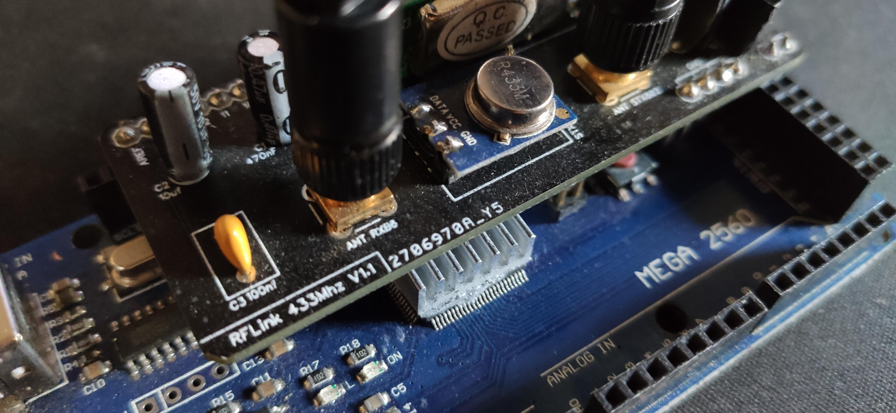
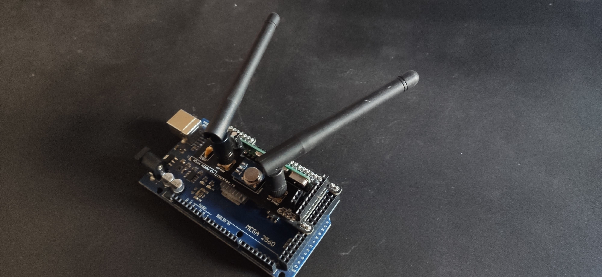
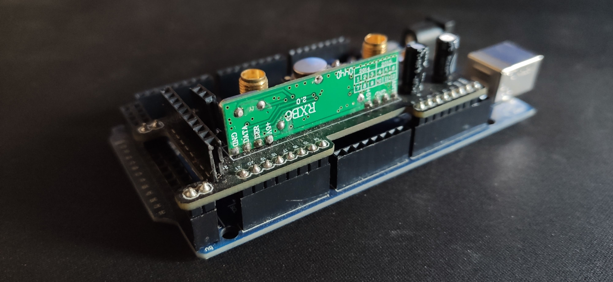
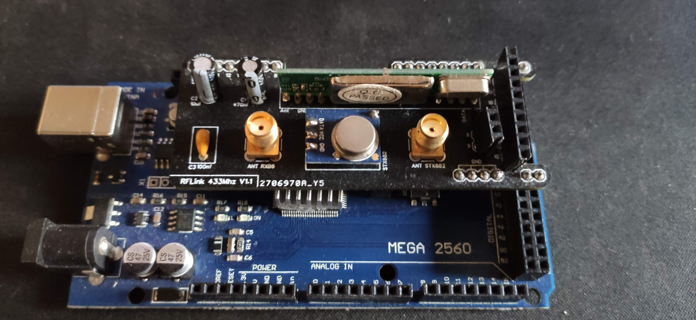
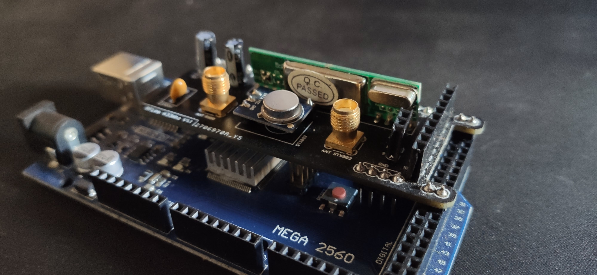

# DIY RFLINK 433Mhz PCB

I'm create a pcb for better integration 433Mhz components on Arduino MEGA. For use it's recommended use RFLINK Software.

i'm use [EasyEDA](https://easyeda.com/) software for create this schematic and PCB. 

All file is easyeda export. 
For open file, create account, Open EasyEDA and click Open > EasyEDA.

**Your contributions are welcome !**

Requiered components : 
* RXB6
* STX88
* 2 SMA Connector
* Condensator :
  * 10uf
  * 470nF
* Condensator ceramic : 
  * 100nF

## Schematic

## PCB

