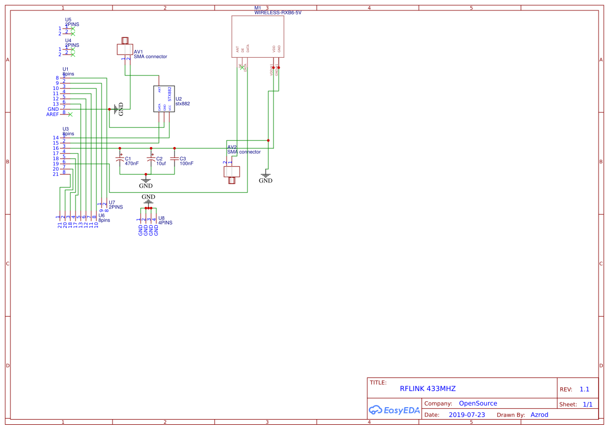
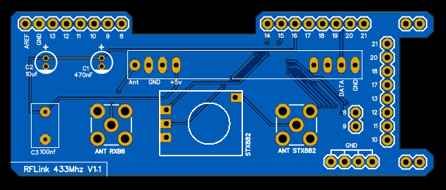

# DIY RFLINK 433Mhz PCB

I'm create a pcb for better integration 433Mhz components on Arduino MEGA. For use it's recommended use RFLINK Software.

i'm use [EasyEDA](https://easyeda.com/) software for create this schematic and PCB. 

All file is easyeda export. 
For open file, create account, Open EasyEDA and click Open > EasyEDA.

**Your contributions are welcome !**

## Schematic

## PCB

